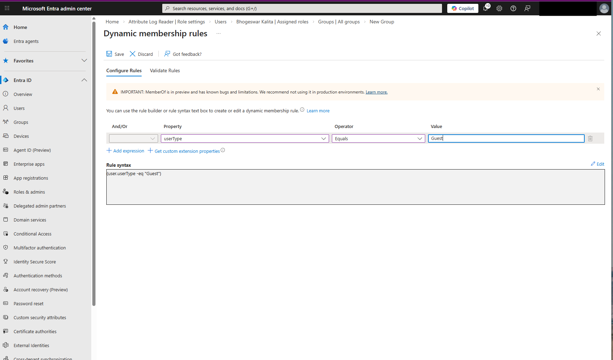
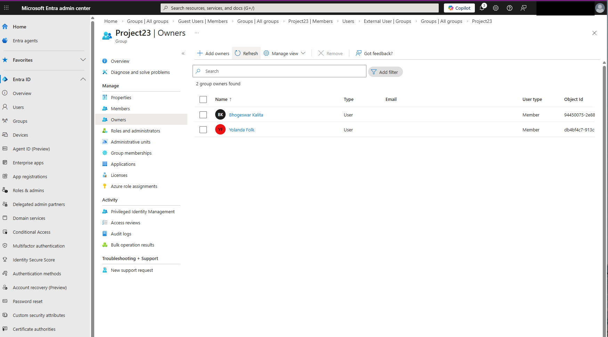
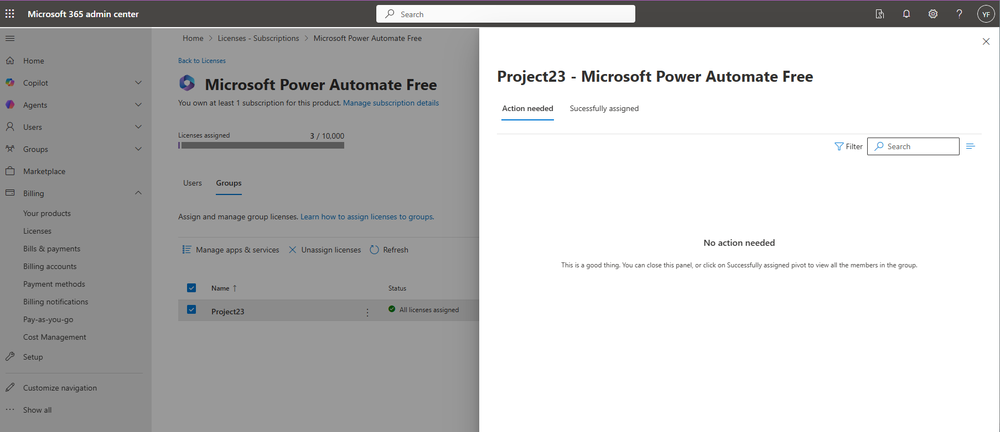

# Lab: Microsoft Entra Group Management and Automated Membership

## Project Overview
In this lab, I implemented and configured various group types within Microsoft Entra ID to streamline identity governance. I deployed both static and dynamic membership rules, demonstrating how to automate security access and resource allocation (licensing) for specific user populations across an enterprise tenant.

* Tools Used: Microsoft Entra Admin Center, Microsoft 365 Admin Center.
* Key Focus: Resource Governance, Dynamic Query Logic, and Role Delegation.

---

## Technical Execution

### 1. Microsoft 365 Group Collaboration
* Task: Provisioned a collaboration-focused group (Project23).
* Process: Configured a Microsoft 365 group for a specific business use case (AI Simulation Project) and performed the manual assignment of core project members to establish the initial collaboration environment.

### 2. Automated Security via Dynamic Membership
* Task: Scaled security management using Dynamic Groups.
* Process: Created a "Guest Users" security group and implemented a Dynamic User Query using the logic `(user.userType -eq "Guest")`. This ensures that any current or future guest accounts are automatically added to this security perimeter without manual intervention.

### 3. Membership Life-Cycle Management
* Task: Updated group memberships using multiple administrative pathways.
* Process: Demonstrated technical flexibility by managing user-to-group associations through both the Groups Interface and the User Profile Interface, ensuring all project contributors were correctly associated with relevant resources.

### 4. Group Governance: Owners and Licensing
* Task: Delegated administrative authority and managed resource costs.
* Implementation:
    * Ownership Delegation: Assigned Bhogeswar Kalita as a Group Owner to facilitate decentralized management.
    * Group-Based Licensing: Utilized the Microsoft 365 Admin Center to assign Power Automate Free licenses to the group, ensuring all members receive necessary software seats automatically upon joining.

---

## Security Analysis & Best Practices

* Dynamic Groups vs. Manual Errors: By utilizing Dynamic Membership for guests, I reduced the risk of "stale" permissions. Users are added or removed based on their actual attributes, which is a key component of Identity Governance and the principle of maintaining a clean directory.
* Delegated Administration: Assigning group owners follows the Principle of Least Privilege. By allowing project leads to manage their own members, I reduced the requirement for high-level Global Admin intervention for routine tasks, improving operational efficiency.
* License Optimization: Implementing Group-Based Licensing ensures that licenses are only consumed by active members of a specific project, preventing "license sprawl" and reducing organizational costs.

---

## Evidence of Completion
> [!NOTE]
> All sensitive Tenant IDs and Admin accounts have been redacted to maintain Operational Security.

### Automated Membership: Dynamic Query Configuration

### Administrative Delegation: Group Ownership

### Resource Allocation: Group-Based Licensing

---

## Learning Credits
This lab is based on the Microsoft Learn module: Perform basic Group Management tasks in Microsoft Entra ID.
